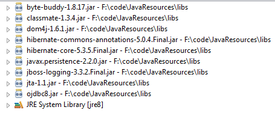
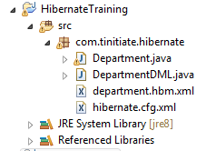

# Components of a Hibernate Simple Project
* Make sure The Oracle JDBC Jar and Hibernate Jars are added to the project 
  jars used in this project. 
    * 
* Steps Create this Hibernate Example
* Create the Database table for this example
* Project Structure and Files explained
* A basic Hibernate Project requires the following code components
  * **Hibernate Config File**
    * This configuration file has the database connection information and 
      schema settings.
  * **Database Entity POJO**
    * This POJO Class will represent the database table/entitity
  * **Mapping XML file for Persistent class**
    * This is an XML file that Maps the POJO to the Database Table/Entity
    * The structure of the XML file
      * **HIBERNATE-MAPPING**
      * Root Element of the mapping XML File.
      * **CLASS**
      * This Element represents the hibernate-mapping, It specifies the
        Persistent Table/Entity POJO class.
      * **ID**
      * This element represents the primary key attribute in the class.
      * **GENERATOR**
      * This is a sub-element of ID element, It is used to generate the primary 
        key values.
      * **PROPERTY** 
      * This element  specifies the property Name or Member variable of the 
        Persistent POJO class, that represents a Table/entity's column.
  * **Session class**
    * This is responsible to create a session factory and session objects.
    * This has the DB Operations, CRUD using Hibernate.
* Project Folder Structure for this example
  * 


## STEP 1. Database Table
* The **departments** Table DDL, this will be used in this Hibernate Example
```
-- Drop and Recreate departments table
drop table departments;

create table departments (
    deptid     int
   ,dept_name  varchar2(100)
   ,primary key(deptid)
);
```

## STEP 2. Hibernate Config File
* This configuration file has the database connection information and 
  schema settings.
```
<?xml version="1.0" encoding="utf-8"?>
<!DOCTYPE hibernate-configuration PUBLIC
"-//Hibernate/Hibernate Configuration DTD 3.0//EN"
"http://hibernate.sourceforge.net/hibernate-configuration-5.3.dtd">
<hibernate-configuration>
    <session-factory>
        <property name="hibernate.connection.driver_class">oracle.jdbc.driver.OracleDriver</property>
        <property name="hibernate.connection.url">jdbc:oracle:thin:@mst01dat:1521:tinitiate</property>
        <property name="hibernate.connection.username">tiuser</property>
        <property name="hibernate.connection.password">tipasswd</property>
        <property name="hibernate.dialect">org.hibernate.dialect.Oracle12cDialect</property>
        <property name="hibernate.default_schema">tinitiate</property>
        <property name="show_sql">true</property>
        <mapping resource="com/tinitiate/hibernate/department.hbm.xml"></mapping>
    </session-factory>
</hibernate-configuration>
```

## STEP 3. Database Entity POJO
* This POJO Class will represent the database table/entitity
```
package com.tinitiate.hibernate;

public class Department implements java.io.Serializable {

    private int deptid;
    private String dept_name;

    public Department() {}

    public Department(int deptid, String dept_name) {
        this.setDeptid(deptid);
        this.setDept_name(dept_name);
    }

    public int getDeptid() {
        return deptid;
    }

    public void setDeptid(int deptid) {
        this.deptid = deptid;
    }

    public String getDept_name() {
        return dept_name;
    }

    public void setDept_name(String dept_name) {
        this.dept_name = dept_name;
    }
}
```


## STEP 4. Mapping XML file for Persistent class
* This is an XML file that Maps the POJO to the Database Table/Entity
* The structure of the XML file
  * **HIBERNATE-MAPPING**
  * Root Element of the mapping XML File.
  * **CLASS**
  * This Element represents the hibernate-mapping, It specifies the
    Persistent Table/Entity POJO class.
  * **ID**
  * This element represents the primary key attribute in the class.
  * **GENERATOR**
  * This is a sub-element of ID element, It is used to generate the primary 
    key values.
  * **PROPERTY** 
  * This element  specifies the property Name or Member variable of the 
    Persistent POJO class, that represents a Table/entity's column.
```
<?xml version="1.0"?>
<!DOCTYPE hibernate-mapping PUBLIC "-//Hibernate/Hibernate Mapping DTD 3.0//EN"
"http://hibernate.sourceforge.net/hibernate-mapping-3.0.dtd">
<hibernate-mapping>
    <class name="com.tinitiate.hibernate.Department" table="DEPARTMENT">
        <id name="deptid" type="int">
            <column name="deptid" precision="5" scale="0" />
            <generator class="assigned" />
        </id>
        <property name="dept_name" column="dept_name" type="string"/>
    </class>
</hibernate-mapping>
```

## STEP 5. Session class
* This is responsible to create a session factory and session objects.
* This has the DB Operations, CRUD using Hibernate.
```
package com.tinitiate.hibernate;
 
import java.util.List;

import org.hibernate.Session; 
import org.hibernate.Transaction;
import org.hibernate.SessionFactory;
import org.hibernate.boot.Metadata;  
import org.hibernate.boot.MetadataSources;  
import org.hibernate.boot.registry.StandardServiceRegistry;  
import org.hibernate.boot.registry.StandardServiceRegistryBuilder;
import org.hibernate.query.Query;

public class DepartmentCRUD {

    public static void main(String[] args) {

        StandardServiceRegistry ssr = new StandardServiceRegistryBuilder().configure("com/tinitiate/hibernate/hibernate.cfg.xml").build();
        Metadata meta = new MetadataSources(ssr).getMetadataBuilder().build();
        SessionFactory factory = meta.getSessionFactoryBuilder().build();
        Session session = factory.openSession();
        Transaction tx = session.beginTransaction();

        Department d1;
        try {
            // ============
            // Insert Rows
            // ============
            // Create New Rows
            d1 = new Department();
            d1.setDeptid(1);
            d1.setDept_name("I.T");
            session.save(d1);

            d1 = new Department();
            d1.setDeptid(2);
            d1.setDept_name("Sales");
            session.save(d1);

            d1 = new Department();
            d1.setDeptid(3);
            d1.setDept_name("Marketing");
            session.save(d1);

            d1 = new Department();
            d1.setDeptid(4);
            d1.setDept_name("Finance");
            session.save(d1);


            // =============
            // GET All Rows
            // =============
            Query query = session.createQuery("from Department");
            List<Department> LD1 = query.list();

            for (int i=0; i < LD1.size(); i++)
                System.out.println(LD1.get(i).getDeptid() + " " + LD1.get(i).getDept_name());


            // ===================
            // Update Existing Row
            // ===================
            // 1. Get the existing row
            d1 = new Department();
            d1 = session.get(Department.class, 1);

            // 2. Set new value
            d1.setDept_name("Information Technology");

            // 3. Save Data
            session.update(d1);


            // =============
            // GET All Rows
            // =============
            query = session.createQuery("from Department");
            LD1 = query.list();

            for (int i=0; i < LD1.size(); i++)
                System.out.println(LD1.get(i).getDeptid() + " " + LD1.get(i).getDept_name());


            // ===================
            // Delete Existing Row
            // ===================
            // 1. Get the existing row
            d1 = new Department();
            d1 = session.get(Department.class, 4);
            session.delete(d1);

            // Commit the Changes to the Database
            tx.commit();

            // =============
            // GET All Rows
            // =============
            query = session.createQuery("from Department");
            LD1 = query.list();

            for (int i=0; i < LD1.size(); i++)
                System.out.println(LD1.get(i).getDeptid() + " " + LD1.get(i).getDept_name());


        } catch(Exception e) {
            if (tx.isActive()) { tx.rollback(); }
            throw e;
        }
        finally {
            factory.close();
            session.close();
        }
    }
}
```
