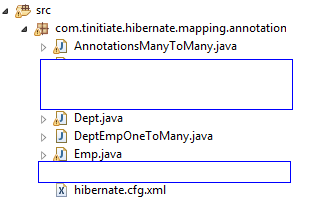

# Hibernate Database Table Many to Many Mapping with Annotations
* This example demonstrates, using Hibernate to perform CRUD operations on THREE
  Tables to demonstrate the Many to Many relationship using the annotations mapping.
* Make sure The Oracle JDBC Jar and Hibernate Jars are added to the project
  jars used in this project.
    * 
* Steps Create this Hibernate Example
* Create the Database table for this example
* Project Structure and Files explained
* A basic Hibernate Project requires the following code components
  * **Hibernate Config File**
    * This configuration file has the database connection information and
      schema settings.
    * This has Mapping references to the POJO Class Files that represent the Database Tables
  * **Database Entity POJOs**
    * This POJO Class will represent the database table/entitity for the Three tables
    * All mappings are part created using Annotations.
  * **Session class**
    * This is responsible to create a session factory and session objects.
    * This has the DB Operations, CRUD using Hibernate.
* Project Folder Structure for this example
  * 


## STEP 1. Database Table
* The **departments** Table DDL, this will be used in this Hibernate Example
```
-- Drop Tables
drop table projects;
drop table emp;
drop table dept;

-- Department Table
create table dept (
    deptid     int
   ,dept_name  varchar2(100)
   ,primary key(deptid)
);

-- Employee Table
create table emp (
    empid       int
   ,join_date   date
   ,sal         number(10,2)
   ,primary key(empid)
);

-- projects Table
create table projects (
    deptid      int
   ,empid       int
   ,constraint fk_projects_emp foreign key (empid) references emp (empid)
   ,constraint fk_projects_dept foreign key (deptid) references dept (deptid)
);
```

## STEP 2. Hibernate Config File
* This configuration file has the database connection information and
  schema settings.
```
<?xml version="1.0" encoding="utf-8"?>
<!DOCTYPE hibernate-configuration PUBLIC
"-//Hibernate/Hibernate Configuration DTD 3.0//EN"
"http://hibernate.sourceforge.net/hibernate-configuration-5.3.dtd">
<hibernate-configuration>
    <session-factory>
        <property name="hibernate.connection.driver_class">oracle.jdbc.driver.OracleDriver</property>
        <property name="hibernate.connection.url">jdbc:oracle:thin:@mstin:1521:tinitiate</property>
        <property name="hibernate.connection.username">tiuser</property>
        <property name="hibernate.connection.password">tipasswd</property>
        <property name="hibernate.dialect">org.hibernate.dialect.Oracle12cDialect</property>
        <property name="hibernate.default_schema">tinitiate</property>
        <property name="show_sql">true</property>
        <mapping class="com.tinitiate.hibernate.mapping.annotation.Dept"/>
        <mapping class="com.tinitiate.hibernate.mapping.annotation.Emp"/>
    </session-factory>
</hibernate-configuration>
```

## STEP 3. Database Entity POJO
* This POJO Class will represent the database Parent table/entitity
* This POJO has the Annotations to Specify the Table (Entity), the columns and
  the Primary key.
* The `@ManyToMany` annotation indicates the column that is the Primary Key in
  the Parent table refers to the Many to Many Child table POJO.
* The `@JoinTable` annotation indicates that this POJO encompases both 
  Dept to Project tables.
* In this case the tables are Dept -< (One2Many) Project (Many2One) >- Emp
* Where `Dept` and `Emp` are the parent tables for the `Project` Table.
```
package com.tinitiate.hibernate.mapping.annotation;

import java.util.HashSet;
import java.util.Set;
import javax.persistence.Column;
import javax.persistence.Entity;
import javax.persistence.FetchType;
import javax.persistence.Id;
import javax.persistence.CascadeType;
import javax.persistence.JoinColumn;
import javax.persistence.JoinTable;
import javax.persistence.ManyToMany;
import javax.persistence.Table;

@Entity
@Table(name = "dept")
public class Dept implements java.io.Serializable {

    private Integer deptid;
    private String dept_name;
    private Set<Emp> emps = new HashSet<Emp>(0);

    public Dept() {}

    public Dept(Integer deptid, String dept_name) {
        this.deptid = deptid;
        this.dept_name = dept_name;
    }

    public Dept(Integer deptid, String dept_name, Set<Emp> emps) {
        this.deptid = deptid;
        this.dept_name = dept_name;
        this.emps = emps;
    }

    @Id
    @Column(name = "deptid")
    public Integer getDeptid() {
        return deptid;
    }

    public void setDeptid(Integer deptid) {
        this.deptid = deptid;
    }

    @Column(name = "dept_name")
    public String getDept_name() {
        return dept_name;
    }

    public void setDept_name(String dept_name) {
        this.dept_name = dept_name;
    }

    @ManyToMany(fetch = FetchType.LAZY, cascade = CascadeType.ALL)
    @JoinTable( name = "projects"
               ,joinColumns = {@JoinColumn(name = "deptid", nullable = false, updatable = false) }
               ,inverseJoinColumns = { @JoinColumn(name = "empid", nullable = false, updatable = false) })
    public Set<Emp> getEmps() {
        return emps;
    }

    public void setEmps(Set<Emp> emps) {
        this.emps = emps;
    }

}
```
* This POJO Class will represent the database Child table/entitity
* This POJO has the Annotations to Specify the Table (Entity), the columns and
  the Primary key.
* The `@ManyToMany` that the column that is the key column that is 
  used as foreign key to which it refers to the. Parent table refers 
  to the Child table POJO.
```
package com.tinitiate.hibernate.mapping.annotation;

import java.sql.Date;
import java.util.HashSet;
import java.util.Set;
import javax.persistence.Column;
import javax.persistence.Entity;
import javax.persistence.FetchType;
import javax.persistence.GeneratedValue;
import static javax.persistence.GenerationType.IDENTITY;
import javax.persistence.Id;
import javax.persistence.ManyToMany;
import javax.persistence.Table;

@Entity
@Table(name = "emp")
public class Emp implements java.io.Serializable {

    private Integer empid;
    private Date join_date;
    private Double sal;
    private Set<Dept> dept_proj = new HashSet<Dept>(0);

    public Emp() {}

    public Emp(Integer empid, Date join_date, Double sal) {
        this.empid = empid;
        this.join_date = join_date;
        this.sal = sal;
    }

    public Emp(Integer empid, Date join_date, Double sal, Set<Dept> dept_proj) {
        this.empid = empid;
        this.join_date = join_date;
        this.sal = sal;
        this.dept_proj = dept_proj;
    }


    @Id
    @Column(name = "EMPID", unique = true, nullable = false)
    public Integer getEmpid() {
        return empid;
    }

    public void setEmpid(Integer empid) {
        this.empid = empid;
    }

    @Column(name = "JOIN_DATE")
    public Date getJoin_date() {
        return join_date;
    }

    public void setJoin_date(Date join_date) {
        this.join_date = join_date;
    }

    @Column(name = "SAL")
    public Double getSal() {
        return sal;
    }

    public void setSal(Double sal) {
        this.sal = sal;
    }

    @ManyToMany(fetch = FetchType.LAZY, mappedBy = "emps")
    public Set<Dept> getDept_proj() {
        return dept_proj;
    }

    public void setDept_proj(Set<Dept> dept_proj) {
        this.dept_proj = dept_proj;
    }

}
```


## STEP 4. Session class
* This is responsible to create a session factory and session objects.
* This has the DB Operations, CRUD using Hibernate, with Mapping Annotations
```
package com.tinitiate.hibernate.mapping.annotation;

import java.text.ParseException;
import java.text.SimpleDateFormat;
import java.util.HashSet;
import java.util.List;
import java.util.Set;
import javax.persistence.criteria.CriteriaQuery;
import org.hibernate.Session;
import org.hibernate.SessionFactory;
import org.hibernate.Transaction;
import org.hibernate.boot.Metadata;
import org.hibernate.boot.MetadataSources;
import org.hibernate.boot.registry.StandardServiceRegistry;
import org.hibernate.boot.registry.StandardServiceRegistryBuilder;

public class AnnotationsManyToMany {

    public static void main(String[] args) throws ParseException {

        // Read Hibernate Config XML file and
        // create Session, Transaction Object
        // ==================================
        StandardServiceRegistry standardRegistry = new StandardServiceRegistryBuilder()
                .configure("com/tinitiate/hibernate/mapping/annotation/hibernate.cfg.xml").build();
        Metadata metadata = new MetadataSources(standardRegistry).getMetadataBuilder().build();
        SessionFactory factory = metadata.getSessionFactoryBuilder().build();

        Session session = factory.openSession();
        Transaction tx = session.beginTransaction();

        // Create a DEPT object, this is used to create a record for the 
        // Dept table
        Dept D1 = new Dept(1,"IT");
        
        // Create a EMP object, this is used to 
        // create a record for the Emp table
        // =====================================
        Emp E1 = new Emp();
            SimpleDateFormat format = new SimpleDateFormat("yyyyMMdd");
            java.util.Date parsed = format.parse("20180210");
            java.sql.Date join_date = new java.sql.Date(parsed.getTime());
        E1.setEmpid(1);
        E1.setJoin_date(join_date);
        E1.setSal(1000.00);

        // Create another EMP object, this is used 
        // to create a record for the Emp table
        // =======================================
        Emp E2 = new Emp();
            SimpleDateFormat format1 = new SimpleDateFormat("yyyyMMdd");
            java.util.Date parsed1 = format1.parse("20180210");
            java.sql.Date join_date1 = new java.sql.Date(parsed1.getTime());
        E2.setEmpid(2);
        E2.setJoin_date(join_date1);
        E2.setSal(1000.00);
        
        // Copy the Employee Objects into a SET
        Set<Emp> emps = new HashSet<Emp>();
        emps.add(E1);
        emps.add(E2);
        
        // Add the EMP Records Set to the Dept Object
        D1.setEmps(emps);
        
        
        // Save the data and commit
        session.save(E1);
        session.save(E2);
        session.save(D1);
        tx.commit();
        
        
        // GET All Rows
        // =============
        CriteriaQuery cqDept = session.getCriteriaBuilder().createQuery(Dept.class);
        cqDept.from(Dept.class);

        List<Dept> LD1 = session.createQuery(cqDept).getResultList();

        System.out.println("Department Table Data");
        for (int i=0; i < LD1.size(); i++)
            System.out.println(LD1.get(i).getDeptid() + " " + LD1.get(i).getDept_name());

        CriteriaQuery cqEmp = session.getCriteriaBuilder().createQuery(Emp.class);
        cqEmp.from(Emp.class);

        List<Emp> LE1 = session.createQuery(cqEmp).getResultList();

        System.out.println("Employee Table Data");
        for (int i=0; i < LE1.size(); i++)
            System.out.println(  LE1.get(i).getEmpid() + " " 
                               + LE1.get(i).getSal() + " " 
                               + LE1.get(i).getJoin_date());

        session.close();
        factory.close();
    }

}
```
