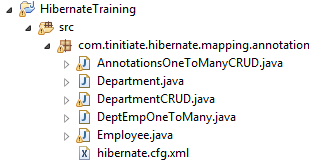

# Hibernate Database Table Mapping with Annotations
* This example demonstrates, using Hibernate to perform CRUD operations on a 
  Table using the annotations mapping. Where there is a Parent Table with 
  primary key and Child table with the foreign key.
* Make sure The Oracle JDBC Jar and Hibernate Jars are added to the project 
  jars used in this project. 
    * 
* Steps Create this Hibernate Example
* Create the Database table for this example
* Project Structure and Files explained
* A basic Hibernate Project requires the following code components
  * **Hibernate Config File**
    * This configuration file has the database connection information and 
      schema settings.
    * This has Mapping references to the POJO Class Files that represent the Database Tables  
  * **Database Entity POJO**
    * This POJO Class will represent the database table/entitity
    * All mappings are part created using Annotations.
  * **Session class**
    * This is responsible to create a session factory and session objects.
    * This has the DB Operations, CRUD using Hibernate.
* Project Folder Structure for this example
  * 


## STEP 1. Database Table
* The **departments** Table DDL, this will be used in this Hibernate Example
```
-- Drop Tables
drop table employee;
drop table department;

-- Department Table
create table department (
    deptid     int
   ,dept_name  varchar2(100)
   ,primary key(deptid)
);

-- Employee Table
create table employee (
    empid      int
   ,deptid      int
   ,join_date   date
   ,sal         number(10,2)
   ,primary key(empid)
   ,constraint fk_department foreign key (deptid) references department (deptid)
);
```

## STEP 2. Hibernate Config File
* This configuration file has the database connection information and 
  schema settings.
```
<?xml version="1.0" encoding="utf-8"?>
<!DOCTYPE hibernate-configuration PUBLIC
"-//Hibernate/Hibernate Configuration DTD 3.0//EN"
"http://hibernate.sourceforge.net/hibernate-configuration-5.3.dtd">
<hibernate-configuration>
    <session-factory>
        <property name="hibernate.connection.driver_class">oracle.jdbc.driver.OracleDriver</property>
        <property name="hibernate.connection.url">jdbc:oracle:thin:@mstin:1521:tinitiate</property>
        <property name="hibernate.connection.username">tiuser</property>
        <property name="hibernate.connection.password">tipasswd</property>
        <property name="hibernate.dialect">org.hibernate.dialect.Oracle12cDialect</property>
        <property name="hibernate.default_schema">tinitiate</property>
        <property name="show_sql">true</property>
        <mapping class="com.tinitiate.hibernate.mapping.annotation.DeptEmpOneToMany"/>
        <mapping class="com.tinitiate.hibernate.mapping.annotation.Employee"/>
    </session-factory>
</hibernate-configuration>
```

## STEP 3. Database Entity POJO
* This POJO Class will represent the database Parent table/entitity
* This POJO has the Annotations to Specify the Table (Entity), the columns and 
  the Primary key.
* The `@OneToMany` annotation indicates the column that is the Primary Key in 
  the Parent table refers to the Child table POJO.
```
package com.tinitiate.hibernate.mapping.annotation;
import java.util.Set;

import javax.persistence.*;

@Entity
@Table(name = "Department")
public class DeptEmpOneToMany {

    @Id
    @Column(name = "deptid")
    private int deptid;

    @Column(name = "dept_name")
    private String dept_name;

    // Foreign key Reference Annotation
    @OneToMany(mappedBy = "department")
    private Set<Employee> employees;


    public int getDeptid() {
        return deptid;
    }

    public void setDeptid(int deptid) {
        this.deptid = deptid;
    }

    public String getDept_name() {
        return dept_name;
    }

    public void setDept_name(String dept_name) {
        this.dept_name = dept_name;
    }

    public Set<Employee> getemployees() {
        return this.employees;
    }

    public void setemployees(Set<Employee> employees) {
        this.employees = employees;
    }
}
```
* This POJO Class will represent the database Child table/entitity
* This POJO has the Annotations to Specify the Table (Entity), the columns and 
  the Primary key.
* The `@ManyToOne` and the `@JoinColumn` annotations indicates the column 
  that is the key column that is used as foreign key to which it refers to the
  Parent table refers to the Child table POJO.
```
package com.tinitiate.hibernate.mapping.annotation;

import java.sql.Date;
import javax.persistence.Column;
import javax.persistence.Entity;
import javax.persistence.FetchType;
import javax.persistence.Id;
import javax.persistence.JoinColumn;
import javax.persistence.ManyToOne;
import javax.persistence.Table;

@Entity
@Table(name = "Employee")
public class Employee {
    
    // Primary key Annotation
    @Id
    @Column(name = "empid")
    private int empid;

    @Column(name = "join_date")
    private Date join_date;

    @Column(name = "sal")
    private double sal;

    @ManyToOne
    @JoinColumn(name = "deptid", nullable = false)
    private DeptEmpOneToMany department;
    
    // Constructors
    // ============
    public Employee() {}
    
    public Employee(int empid, Date join_date, double sal, DeptEmpOneToMany department) {
        this.empid = empid;
        this.join_date = join_date;
        this.sal = sal;
        this.department = department;
    }
    
    // Getters and Setters
    // ===================
    public DeptEmpOneToMany getdepartment() {
        return this.department;
    }

    public void setdepartment(DeptEmpOneToMany department) {
        this.department = department;
    }

    public int getEmpid() {
        return empid;
    }

    public void setEmpid(int empid) {
        this.empid = empid;
    }

    public Date getJoin_date() {
        return join_date;
    }

    public void setJoin_date(Date join_date) {
        this.join_date = join_date;
    }

    public double getSal() {
        return sal;
    }

    public void setSal(double sal) {
        this.sal = sal;
    }

}
```  


## STEP 4. Session class
* This is responsible to create a session factory and session objects.
* This has the DB Operations, CRUD using Hibernate, with Mapping Annotations
```
package com.tinitiate.hibernate.mapping.annotation;


import java.text.ParseException;
import java.text.SimpleDateFormat;
import java.util.List;
import org.hibernate.Session; 
import org.hibernate.Transaction;
import org.hibernate.SessionFactory;
import org.hibernate.boot.Metadata;
import org.hibernate.boot.MetadataSources;
import org.hibernate.boot.registry.StandardServiceRegistry;
import org.hibernate.boot.registry.StandardServiceRegistryBuilder;
import javax.persistence.criteria.CriteriaQuery;


public class AnnotationsOneToManyCRUD {

    public static void main(String[] args) throws ParseException {


        StandardServiceRegistry standardRegistry = new StandardServiceRegistryBuilder()
                .configure("com/tinitiate/hibernate/mapping/annotation/hibernate.cfg.xml").build();
        Metadata metadata = new MetadataSources(standardRegistry).getMetadataBuilder().build();
        SessionFactory factory = metadata.getSessionFactoryBuilder().build();

        Session session = factory.openSession();
        Transaction tx = session.beginTransaction();

        // ==============================================
        // 1. Create the Parent record (Department Table) 
        // ==============================================
        DeptEmpOneToMany DE = new DeptEmpOneToMany();
        DE.setDeptid(1);
        DE.setDept_name("I.T");
        session.save(DE);

        // ===========================================
        // 2.0 Create A Child record (Employee Table) 
        // ===========================================
        Employee e1 = new Employee();
        e1.setEmpid(1);
            SimpleDateFormat format = new SimpleDateFormat("yyyyMMdd");
            java.util.Date parsed = format.parse("20180210");
            java.sql.Date join_date = new java.sql.Date(parsed.getTime());
        e1.setJoin_date(join_date);
        e1.setSal(1000.00);
        // ======================================================
        // 2.1 Use the Parent Record  (Department Table)
        //     to get the Child record's DeptID (Employee Table) 
        // ======================================================
        e1.setdepartment(DE);
        session.save(e1);


        // ================================================
        // 3.0 Create another Child record (Employee Table) 
        // ================================================
        Employee e2 = new Employee();
        e2.setEmpid(2);
            format = new SimpleDateFormat("yyyyMMdd");
            parsed = format.parse("20180211");
            join_date = new java.sql.Date(parsed.getTime());
        e2.setJoin_date(join_date);
        e2.setSal(2000.00);
        // ======================================================
        // 3.1 Use the Parent Record  (Department Table)
        //     to get the Child record's DeptID (Employee Table) 
        // ======================================================
        e2.setdepartment(DE);
        session.save(e2);


        // ==================
        // 4. Update record  
        // ==================
        // 1. Get a Row/Record that needs the update
        DeptEmpOneToMany DE1 = new DeptEmpOneToMany();
        DE1 = session.get(DeptEmpOneToMany.class, 1);
        
        // 2. Set new value
        DE1.setDept_name("Information Technology");

        // 3. Update Data
        session.update(DE1);


        // ==================
        // 5. Delete record  
        // ==================
        // 1. Get a Row/Record that needs the update
        Employee E1 = new Employee();
        E1 = session.get(Employee.class, 1);

        // 2. Update Data
        session.delete(E1);

        // Commit Transaction
        tx.commit();


        // =============
        // 6. GET All Rows
        // =============
        CriteriaQuery cqDept = session.getCriteriaBuilder().createQuery(DeptEmpOneToMany.class);
        cqDept.from(DeptEmpOneToMany.class);

        List<DeptEmpOneToMany> LD1 = session.createQuery(cqDept).getResultList();

        System.out.println("Department Table Data");
        for (int i=0; i < LD1.size(); i++)
            System.out.println(LD1.get(i).getDeptid() + " " + LD1.get(i).getDept_name());

        CriteriaQuery cqEmp = session.getCriteriaBuilder().createQuery(Employee.class);
        cqEmp.from(Employee.class);

        List<Employee> LE1 = session.createQuery(cqEmp).getResultList();

        System.out.println("Employee Table Data");
        for (int i=0; i < LE1.size(); i++)
            System.out.println(  LE1.get(i).getEmpid() + " " 
                               + LE1.get(i).getdepartment().getDeptid() + " "
                               + LE1.get(i).getSal() + " " 
                               + LE1.get(i).getJoin_date());

        session.close();
        factory.close();
    }

}
```
