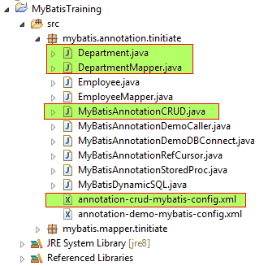

# MyBatis demonstration using Annotations CRUD with Oracle DB (Non Maven)
* Here we demonstrate a MyBatis - Oracle application with a CRUD operation.
* This application uses Annotations of MyBatis to Create, Read, Update, Delete 
  (CRUD) Oracle DB table data.
* We connect to Oracle DB and work on a Oracle table with various DataTypes.
* STEPS INVOLVED
  * **PROJECT SETUP SCREENSHOT:**

  * `STEP 1.` Add the MyBatis JAR and Oracle JDBC JAR to your project. 
  * `STEP 2.` Create Oracle Tables.
  * `STEP 3.` MyBatis Config XML File.
  * `STEP 4.` Create Java Department Table POJO Classes.
  * `STEP 5.` Create Java Department Mapper.
  * `STEP 6.` Create Java MyBatis Annotation CRUD processing to demonstrate CRUD.


## STEP 2. Create Oracle Tables
* In this step we create DEPARTMENT Oracle table.
* Make sure the `SCHEMA` in which these tables are created, is used as the
  Oracle user in the MyBatis Config XML.
* In our case we are creating the tables in `tinitiate` schema in Oracle.
```
-- 
-- DEPARTMENT TABLE
--
-- Drop if exists
drop table department;

-- Create department Table
create table department (
deptno     number not null,
dname      varchar2(14)
);
-- primary key
alter table department add constraint dept_pk primary key (deptno);
```


## STEP 3. The MyBatis Config File: annotation-crud-mybatis-config.xml
* This is a Config for connecting to Oracle Database
* The URL must have the HostName where the Oracle DB is installed and the 
  Oracle Database name.
  `jdbc:oracle:thin:@//<HOST-NAME>:1521/<DATABASE-NAME>`
```
<?xml version="1.0" encoding="UTF-8"?>
<!DOCTYPE configuration
  PUBLIC "-//mybatis.org//DTD Config 3.0//EN"
  "http://mybatis.org/dtd/mybatis-3-config.dtd">
<configuration>
    <environments default="development">
        <environment id="development">
            <transactionManager type="JDBC"/>
            <dataSource type="POOLED">
                <property name="driver" value="oracle.jdbc.OracleDriver"/>
                <property name="url" value="jdbc:oracle:thin:@//localhost:1521/ORCL"/>
                <property name="username" value="tinitiate"/>
                <property name="password" value="tinitiate"/>
            </dataSource>
        </environment>
    </environments>
</configuration>
```


## STEP 4. Java Department Table POJO Class
* This java code has a direct mapping with the Department Table, the Member 
  Fields of this class match with names and datatype of the Table.
```
package mybatis.annotation.tinitiate;

public class Department {

    private int deptno;
    private String dname;
    
    public Department(int deptno, String dname) {
        super();
        this.deptno = deptno;
        this.dname = dname;
    }

    public Department() {}

    public int getDeptno() {
        return deptno;
    }

    public void setDeptno(int deptno) {
        this.deptno = deptno;
    }

    public String getDname() {
        return dname;
    }

    public void setDname(String dname) {
        this.dname = dname;
    }
}
```


## STEP 5. Create Java Department Mapper.
* This is the **MyBatis** code that has the Annotations
* **@Select**
  * This annotation is used to select data from the DB, it accepts a 
    string with a valid SQL **SELECT** statement.
* **@Insert**
  * This annotation is used to select data from the DB, it accepts a 
    string with a valid SQL **INSERT** statement.
* **@Update**
  * This annotation is used to select data from the DB, it accepts a 
    string with a valid SQL **UPDATE** statement.
* **@Delete**
  * This annotation is used to select data from the DB, it accepts a 
    string with a valid SQL **DELETE** statement.
```
package mybatis.annotation.tinitiate;

import java.util.List;
import org.apache.ibatis.annotations.Delete;
import org.apache.ibatis.annotations.Insert;
import org.apache.ibatis.annotations.Result;
import org.apache.ibatis.annotations.Results;
import org.apache.ibatis.annotations.Select;
import org.apache.ibatis.annotations.Update;

public interface DepartmentMapper {

    // Get All Rows of department Table
    String getAllDeptData = "SELECT deptno,dname from department";

    @Select(getAllDeptData)
    @Results(value = {
        @Result(property = "deptno", column = "deptno"),
        @Result(property = "dname", column = "dname")
    })
    List<Department> getAllDeptData();


    // Get Rows By DeptNo from department Table
    String getDeptByID = "SELECT deptno, dname from department WHERE deptno = #{deptno}";
    @Select(getDeptByID)
    @Results(value = {
        @Result(property = "deptno", column = "deptno"),
        @Result(property = "dname", column = "dname")
    })

    Department getDeptByID(int deptno);


    String InsertRow = "INSERT into department(deptno, dname) VALUES(#{deptno}, #{dname})";
    @Insert(InsertRow)
    void insertDepartment(Department dept);


    String UpdateSalary = "UPDATE department SET dname=#{dname} WHERE deptno =#{deptno}";
    @Update(UpdateSalary)
    void updateDepartment(Department dept);

    
    String DeleteRow = "DELETE FROM department WHERE deptno =#{deptno}"; 
    @Delete(DeleteRow)
    void deleteDepartment(int deptno);
}
```


## STEP 6. Java MyBatis Annotation CRUD
* The mapper program must be called to run the MyBatis application.
* This code creates objects for Create Reader, SqlSessionFactory, SqlSession,
  Department, DepartmentMapper and Session Object.
```
package mybatis.annotation.tinitiate;

import java.io.IOException;
import java.io.Reader;
import java.util.List;
import org.apache.ibatis.io.Resources;
import org.apache.ibatis.session.SqlSession;
import org.apache.ibatis.session.SqlSessionFactory;
import org.apache.ibatis.session.SqlSessionFactoryBuilder;

public class MyBatisAnnotationCRUD {

   public static void main(String args[]) throws IOException {
      
      // STEP 1.
      // =======
      // Create Reader, SqlSessionFactory
      Reader reader = Resources.getResourceAsReader("mybatis/annotation/tinitiate/annotation-crud-mybatis-config.xml");
      SqlSessionFactory sqlSessionFactory = new SqlSessionFactoryBuilder().build(reader);       
      
      // STEP 2.
      // =======
      // Create SqlSession Object Department, Read DepartmentMapper and
      // Department Session
      SqlSession DeptSession = sqlSessionFactory.openSession();
      DeptSession.getConfiguration().addMapper(DepartmentMapper.class);
      DepartmentMapper DMapper = DeptSession.getMapper(DepartmentMapper.class);
      // Create a new Department POJO object
      Department dept = new Department();

      // Test Create (Insert)
      // ===================
      //Set the values
      int[] deptno_arr = new int[]{1,2,3};
      String[] dname_arr = new String[]{"IT", "SALES", "MKTG"};
      
      for (int i=0; i<=2; i++) {
          dept.setDeptno(deptno_arr[i]);
          dept.setDname(dname_arr[i]);
          System.out.println(deptno_arr[i] + " " + dname_arr[i]);
          // Call the Insert Department Method   
          DMapper.insertDepartment(dept);
      }    
      System.out.println("3 records inserted !");


      // Test Update
      // ===========
      // Update 'MKTG' to 'Marketing'
      // 1. For using an Update get the target row
      dept = new Department();
      dept = DMapper.getDeptByID(3);
      // 2. Apply new value to the name field
      dept.setDname("Marketing");
      // 3. Call Update
      DMapper.updateDepartment(dept);
      System.out.println("Update MKTG to Marketing Completed !");
 

      // Test Delete
      // ===========
      // 1. Create an empty object
      dept = new Department();
      // 2. Get the ID that needs to be deleted
      dept = DMapper.getDeptByID(1);
      // 3. call the delete
      DMapper.deleteDepartment(dept.getDeptno());
      System.out.println("Deleted: - " + dept.getDeptno() + " " + dept.getDname());
      // Commit All Above Changes
      DeptSession.commit();


      // Test Read: Get Dept By ID
      // =========================
      dept = new Department();
      dept = DMapper.getDeptByID(2);
      // print Dept of DeptNo 2
      System.out.println("Select DeptNo 2");
      System.out.println(dept.getDeptno() + " " + dept.getDname());


      // Test Read: Get All Dept Rows
      // ============================
      List<Department> l_dept = DMapper.getAllDeptData();
      System.out.println("Select All Rows");
      for(Department d:l_dept) {
          System.out.println(d.getDeptno() + " " + d.getDname());
      }


      // Close Executor
      DeptSession.close();
   }
}
```
