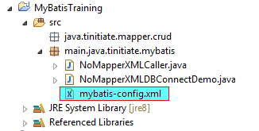

# Non Maven MyBatis demonstration using Annotations with Oracle DB
* Here we demonstrate a MyBatis - Oracle application
* This application uses Annotations of MyBatis to fetch Oracle DB data.
* We connect to Oracle DB and retrive a single value for various DataTypes.
* STEPS INVOLVED
* `STEP 1.` Add the MyBatis JAR and Oracle JDBC JAR to your project. 
* `STEP 2.` Create the Below THREE (3) files
* Project Setup Screenshot:



## The MyBatis Config File: annotation-demo-mybatis-config.xml
* This is a Config for connecting to Oracle Database
* The URL must have the HostName where the Oracle DB is installed and the 
  Oracle Database name.
  `jdbc:oracle:thin:@//<HOST-NAME>:1521/<DATABASE-NAME>`
```
<?xml version="1.0" encoding="UTF-8"?>
<!DOCTYPE configuration
  PUBLIC "-//mybatis.org//DTD Config 3.0//EN"
  "http://mybatis.org/dtd/mybatis-3-config.dtd">
<configuration>
    <environments default="development">
        <environment id="development">
            <transactionManager type="JDBC"/>
            <dataSource type="POOLED">
                <property name="driver" value="oracle.jdbc.OracleDriver"/>
                <property name="url" value="jdbc:oracle:thin:@//localhost:1521/ORCL"/>
                <property name="username" value="tinitiate"/>
                <property name="password" value="tinitiate"/>
            </dataSource>
        </environment>
    </environments>
</configuration>
```


## FILE: MyBatisAnnotationDemoDBConnect.java
* This file reads data from the DUAL table in Oracle database, 
  it retrives data to demonstrate all DataTypes.
* The Annotation `@Select()` executes the SQL statement and returns it to the 
  Method mentioned below.
```
package mybatis.annotation.tinitiate;

import java.util.Date;
import java.sql.Timestamp;
import org.apache.ibatis.annotations.Select;

public interface MyBatisAnnotationDemoDBConnect {

    // Single String DataType value from Database
    @Select("SELECT 'tinitiate.com' as string_data from dual")
    public String getOracleDBString();
    
    // Single Integer DataType value from Database
    @Select("SELECT 111 as integer_data from dual")
    public int getOracleDBInteger();

    // Single Decimal DataType value from Database
    @Select("SELECT 99.11 as decimal_data from dual")
    public double getOracleDBDecimal();

    // Single Date DataType value from Database
    @Select("SELECT sysdate as col_date_data from dual")
    public Date getOracleDBDate();

    // Single Timestamp DataType value from Database
    @Select("SELECT systimestamp as datetime_data from dual")
    public Timestamp getOracleDBDateTime();

    // Single CLOB (Character Long Object) DataType value from Database
    @Select("SELECT to_clob('ABCDEFGHIJKLMNOPQRSTUVWXYZ') as clob_data from dual")
    public String getOracleDBCLOB();   
}
```


## FILE: MyBatisAnnotationDemoCaller.java
* `Very important` the MyBatis configuration XML Path mentioned in the below 
  example must be relative to the project path, It means the path starts
  from the project's root folder, in this case:
  `main/java/tinitiate/mybatis/mybatis-config.xml`
* This java file calls the class file `AnnotationDemoXMLDBConnect.class` and 
  retrives data from the Oracle database.
```
package mybatis.annotation.tinitiate;

import java.io.IOException;
import java.io.Reader;
import java.sql.Timestamp;
import java.util.Date;
import org.apache.ibatis.io.Resources;
import org.apache.ibatis.session.SqlSession;
import org.apache.ibatis.session.SqlSessionFactory;
import org.apache.ibatis.session.SqlSessionFactoryBuilder;

public class MyBatisAnnotationDemoCaller {

    private static SqlSessionFactory factory = null;

    public static void main(String[] args) throws IOException {

        String resource = "mybatis/annotation/tinitiate/AnnotationDemo-mybatis-config.xml";
        Reader reader = null;
        SqlSession session = null;

        reader = Resources.getResourceAsReader(resource);

        factory = new SqlSessionFactoryBuilder().build(reader);
        factory.getConfiguration().addMapper(MyBatisAnnotationDemoDBConnect.class);
        
        reader.close();

        try {
            session = factory.openSession();

            
            // Single Variable String DataType from Database
            String string_data = session.selectOne("getOracleDBString");
            System.out.println(string_data);


            // Single Variable Integer DataType from Database
            int int_data = session.selectOne("getOracleDBInteger");
            System.out.println(int_data);


            // Single Variable Decimal DataType from Database
            double decimal_data = session.selectOne("getOracleDBDecimal");
            System.out.println(decimal_data);


            // Single Variable Date DataType from Database
            Date date_data = session.selectOne("getOracleDBDate");
            System.out.println(date_data);


            // Single Variable Timestamp DataType from Database
            Timestamp datetime_data = session.selectOne("getOracleDBDateTime");
            System.out.println(datetime_data);


            // Single Variable CLOB (Character Long Object) DataType from Database
            String clob_data = session.selectOne("getOracleDBCLOB");
            System.out.println(clob_data);


        } finally {
            if (session != null) {
                session.close();
            }
        }
    }
}
```
