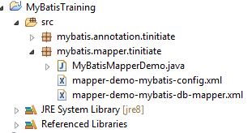
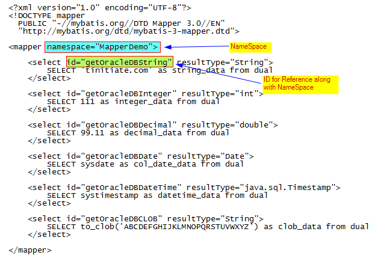
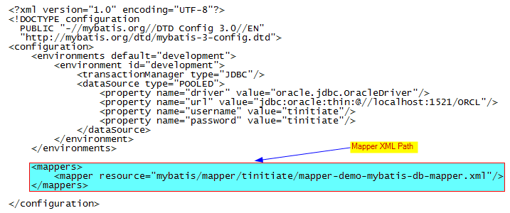

# Non Maven MyBatis demonstration using Mapper XML with Oracle DB
* Here we demonstrate a MyBatis - Oracle application
* This application uses a mapper XML whihc holds the information of SQL that 
  will become the data source from the Oracle DB for MyBatis.
* We connect to Oracle DB and retrive a single value for various DataTypes.
* STEPS INVOLVED
* `STEP 1.` Add the MyBatis JAR and Oracle JDBC JAR to your project. 
* `STEP 2.` Create the Below THREE (3) files
* Project Setup Screenshot:



## Demonstration of Non Maven MyBatis demonstration using Mapper XML with Oracle DB
* Here are the Steps invloved to create a MyBatis Mapper Application
* The process invloves Creating a mybatis config mapper details a mapper XML
  file, that has the SQL code.
* The mapper XML file is called in the MyBatis Config XML
* Steps to follow:
* Step 1. Create MyBatis Mapper Details XML File.

>
* Step 2. Create MyBatis Config XML file, and have a reference to the MyBatis 
  Mapper Details XML file

>


### STEP 1: Create MyBatis Mapper Details XML File.
* The Mapper XML file has SQL statements that will be executed in the DataBase
* They have XML tags such as `<SELECT>` `<INSERT>` .. have an ID associated 
  to them. This ID is used along with the **NAMESPACE** of the MAPPER in the XML
* The `resultType` is what the SQL gets back, it is tied to Java DataTypes 
  both native and objects.
```
<?xml version="1.0" encoding="UTF-8"?>
<!DOCTYPE mapper
  PUBLIC "-//mybatis.org//DTD Mapper 3.0//EN"
  "http://mybatis.org/dtd/mybatis-3-mapper.dtd">

<mapper namespace="MapperDemo">

    <select id="getOracleDBString" resultType="String">
        SELECT 'tinitiate.com' as string_data from dual
    </select>    

    <select id="getOracleDBInteger" resultType="int">
        SELECT 111 as integer_data from dual
    </select>

    <select id="getOracleDBDecimal" resultType="double">
        SELECT 99.11 as decimal_data from dual
    </select>

    <select id="getOracleDBDate" resultType="Date">
        SELECT sysdate as col_date_data from dual
    </select>

    <select id="getOracleDBDateTime" resultType="java.sql.Timestamp">
        SELECT systimestamp as datetime_data from dual
    </select>

    <select id="getOracleDBCLOB" resultType="String">
        SELECT to_clob('ABCDEFGHIJKLMNOPQRSTUVWXYZ') as clob_data from dual
    </select>

</mapper>
```


### STEP 2: Create MyBatis Config XML File.
* The MyBatis Config XML file has DB Connection details and the Mapper XML Path
* Mapper XML path is relative to the pacakge Path of Java
* If pacakge is `mybatis.mapper.tinitiate/` the path is used as:
  `mybatis/mapper/tinitiate/`
```
<?xml version="1.0" encoding="UTF-8"?>
<!DOCTYPE configuration
  PUBLIC "-//mybatis.org//DTD Config 3.0//EN"
  "http://mybatis.org/dtd/mybatis-3-config.dtd">
<configuration>
    <environments default="development">
        <environment id="development">
            <transactionManager type="JDBC"/>
            <dataSource type="POOLED">
                <property name="driver" value="oracle.jdbc.OracleDriver"/>
                <property name="url" value="jdbc:oracle:thin:@//localhost:1521/ORCL"/>
                <property name="username" value="tinitiate"/>
                <property name="password" value="tinitiate"/>
            </dataSource>
        </environment>
    </environments>

    <mappers>
        <mapper resource="mybatis/mapper/tinitiate/mapper-demo-mybatis-db-mapper.xml"/>
    </mappers>

</configuration>
```


### STEP 3. Create Java File Execute SQL from MyBatis Mapper XML
* The Java code calls the MyBatis Config XML
* This creates a Reader / SqlSessionFactory / SqlSession, Using the 
  SqlSession Object a `selectOne` calls the NAMESPACE.SQL-ID from the Mapper XML
```
package mybatis.mapper.tinitiate;

import java.io.IOException;
import java.io.Reader;
import java.util.Date;
import java.sql.Timestamp;
import org.apache.ibatis.io.Resources;
import org.apache.ibatis.session.SqlSession;
import org.apache.ibatis.session.SqlSessionFactory;
import org.apache.ibatis.session.SqlSessionFactoryBuilder;

public class MyBatisMapperDemo {

    public static void main(String[] args) {

        Reader reader;
        try {
            reader = Resources.getResourceAsReader("mybatis/mapper/tinitiate/mapper-demo-mybatis-config.xml");
            SqlSessionFactory sqlSessionFactory = new SqlSessionFactoryBuilder().build(reader);       
            SqlSession session = sqlSessionFactory.openSession();

            // Retrieve Single Value Data using **session.selectOne**
            String    l_OracleDBString   = session.selectOne("MapperDemo.getOracleDBString");
            int       l_OracleDBInteger  = session.selectOne("MapperDemo.getOracleDBInteger");
            double    l_OracleDBDecimal  = session.selectOne("MapperDemo.getOracleDBDecimal");
            Date      l_OracleDBDate     = session.selectOne("MapperDemo.getOracleDBDate");
            Timestamp l_OracleDBDateTime = session.selectOne("MapperDemo.getOracleDBDateTime");
            String    l_OracleDBCLOB     = session.selectOne("MapperDemo.getOracleDBCLOB");


            // print the retrieved values
            System.out.println(l_OracleDBString);
            System.out.println(l_OracleDBInteger);
            System.out.println(l_OracleDBDecimal);
            System.out.println(l_OracleDBDate);
            System.out.println(l_OracleDBDateTime);
            System.out.println(l_OracleDBCLOB);

            session.commit();   
            session.close();

        } catch (IOException e) { e.printStackTrace(); }
    }
}
```
