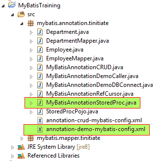

# Non Maven MyBatis demonstration of executing Oracle Stored Procedure using MyBatis Annotations
* Here we demonstrate a MyBatis - Oracle application where we execute and 
  capture results from an Oracle Stored Procedure.
* Project Setup Screenshot:



## STEP 1: Create MyBatis Config XML File.
* The MyBatis Config XML file has DB Connection details 
* Mapper XML path is relative to the pacakge Path of Java
* If pacakge is `mybatis.mapper.tinitiate/` the path is used as:
  `mybatis/mapper/tinitiate/`
```
<?xml version="1.0" encoding="UTF-8"?>
<!DOCTYPE configuration
  PUBLIC "-//mybatis.org//DTD Config 3.0//EN"
  "http://mybatis.org/dtd/mybatis-3-config.dtd">
<configuration>
    <environments default="development">
        <environment id="development">
            <transactionManager type="JDBC"/>
            <dataSource type="POOLED">
                <property name="driver" value="oracle.jdbc.OracleDriver"/>
                <property name="url" value="jdbc:oracle:thin:@//localhost:1521/ORCL"/>
                <property name="username" value="tinitiate"/>
                <property name="password" value="tinitiate"/>
            </dataSource>
        </environment>
    </environments>

    <mappers>
        <mapper resource="mybatis/mapper/tinitiate/mapper-demo-mybatis-db-mapper.xml"/>
    </mappers>

</configuration>
```


## STEP 2. Oracle Stored Procedure
* This is the Oracle Stored Procedure, That has 3 parameters 2 input 
  and 1 out put parameter.
* The Add_numbers stored procedure will add the TWO input parameters.
```
drop procedure add_numbers;
create or replace procedure tinitiate.add_numbers
    (n1 in int, n2 in int, res out int)
as
begin
    res := n1 + n2;
end add_numbers;
```


### STEP 3. Create Java POJO Class that represents the Stored Procedure
* The Java code that represents the Oracle Stored Procedure
* In this case Integer N1, Integer N2, Integer Res. the three parameters
```
package mybatis.annotation.tinitiate;

public class StoredProcPojo {

    public Integer N1;
    public Integer N2;
    public Integer Res;
}
```


### STEP 4. Create Java File That Executes Oracle Stored Procedure Using MyBatis
* The Java code calls the MyBatis Config XML, Uses the the Annotation of MyBatis
  and Executes the Oracle Stored Procedure.
* Class that uses the Interface
 * This creates Resource-SQLSession using the Config XML 
 * Create the SQLSession Factory Object
 * Create the POJO Class with Stored Procedure parameters
 * Execute The Oracle Stored Procedure using the session.selectOne
 * Print the Params POJO Objects "Res" parameter to see the output
```
package mybatis.annotation.tinitiate;

import java.io.IOException;
import java.io.Reader;

import org.apache.ibatis.annotations.Options;
import org.apache.ibatis.annotations.Results;
import org.apache.ibatis.annotations.Result;
import org.apache.ibatis.annotations.ResultType;
import org.apache.ibatis.annotations.Select;
import org.apache.ibatis.io.Resources;
import org.apache.ibatis.mapping.StatementType;
import org.apache.ibatis.session.SqlSession;
import org.apache.ibatis.session.SqlSessionFactory;
import org.apache.ibatis.session.SqlSessionFactoryBuilder;


// Interface that represents the Oracle Stored Procedure
interface MyBatisAnnotationSP {

    // Single String DataType value from Database
    @Select(value= "{ CALL add_numbers( #{N1, mode=IN, jdbcType=INTEGER }, #{N2, mode=IN, jdbcType=INTEGER }, #{Res, mode=OUT, jdbcType=INTEGER }) }")
    @Options(statementType = StatementType.CALLABLE)
    @ResultType(StoredProcPojo.class)
    @Results({
        @Result(property="N1", column="N1"),
        @Result(property="N2", column="N2"),
        @Result(property="Res", column="Res"),
    })
    public void runOracleSP(StoredProcPojo params);
}


// Class that uses the Interface
// 1. This creates Resource-SQLSession using the Config XML 
// 2. Create the SQLSession Factory Object
// 3. Create the POJO Class with Stored Procedure parameters
// 4. Execute The Oracle Stored Procedure using the session.selectOne
// 5. Print the Params POJO Objects "Res" parameter to see the output   
public class MyBatisAnnotationStoredProc {

    private static SqlSessionFactory factory = null;

    public static void main(String[] args) throws IOException {

        String resource = "mybatis/annotation/tinitiate/annotation-demo-mybatis-config.xml";
        Reader reader = null;
        SqlSession session = null;

        reader = Resources.getResourceAsReader(resource);

        factory = new SqlSessionFactoryBuilder().build(reader);
        factory.getConfiguration().addMapper(MyBatisAnnotationSP.class);
        
        reader.close();
        
        // Assign Params
        StoredProcPojo Params = new StoredProcPojo();  
        Params.N1 = 1;
        Params.N2 = 1;
        Params.Res = null;
        
        try {
            session = factory.openSession();
            // Single Variable CLOB (Character Long Object) DataType from Database
            session.selectOne("runOracleSP",Params);

        } finally {
            if (session != null) {
                session.close();
            }
        }
        System.out.println(Params.Res);
    }
}
```
