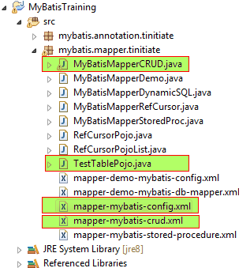

# MyBatis demonstration using Mapper XML to perform CRUD operations Oracle DB (Non Maven)
* Here we demonstrate a MyBatis - Oracle application with a CRUD operation.
* This application uses Mapper XML of MyBatis to Create, Read, Update, Delete 
  (CRUD) Oracle DB table data.
* We connect to Oracle DB and work on a Oracle table with various DataTypes.
* STEPS INVOLVED
  * **PROJECT SETUP SCREENSHOT:**


  * `PRE REQ.` Add the MyBatis JAR and Oracle JDBC JAR to your project.
  * `STEP 1.` Create Oracle Table TestTable.
  * `STEP 2.` MyBatis Config XML File.
  * `STEP 3.` MyBatis Mapper XML File.
  * `STEP 4.` Create Java TestTable Table POJO Classes.
  * `STEP 5.` Create Java MyBatis Mapper CRUD Processor to demonstrate CRUD.


## STEP 1. Create Oracle Tables
* In this step we create TestTable Oracle table.
* Make sure the `SCHEMA` in which these tables are created, is used as the
  Oracle user in the MyBatis Config XML.
* In our case we are creating the tables in `tinitiate` schema in Oracle.
```
-- TestTable TABLE
--
-- Drop if exists
drop table TestTable;

-- Create TestTable Table
create table TestTable (
    test_id       number not null
   ,test_date     date
   ,test_str      varchar2(14)
   ,test_decimal  number(10,4)
);
```


## STEP 2. The MyBatis Config File: mapper-mybatis-config.xml
* This is a Config for connecting to Oracle Database
* The URL must have the HostName where the Oracle DB is installed and the 
  Oracle Database name.
  `jdbc:oracle:thin:@//<HOST-NAME>:1521/<DATABASE-NAME>`
* The XML Config file has the Mapper reference to the Mapper XML file.
```
<?xml version="1.0" encoding="UTF-8"?>
<!DOCTYPE configuration
  PUBLIC "-//mybatis.org//DTD Config 3.0//EN"
  "http://mybatis.org/dtd/mybatis-3-config.dtd">
<configuration>
    <environments default="development">
        <environment id="development">
            <transactionManager type="JDBC"/>
            <dataSource type="POOLED">
                <property name="driver" value="oracle.jdbc.OracleDriver"/>
                <property name="url" value="jdbc:oracle:thin:@//localhost:1521/ORCL"/>
                <property name="username" value="tinitiate"/>
                <property name="password" value="tinitiate"/>
            </dataSource>
        </environment>
    </environments>

    <mappers>
        <mapper resource="mybatis/mapper/tinitiate/mapper-mybatis-crud.xml"/>
    </mappers>
</configuration>
```


## STEP 3: Create MyBatis Mapper Details XML File.
* The Mapper XML file has SQL statements that will be executed in the DataBase
* They have XML tags such as `<SELECT>` `<INSERT>` .. have an ID associated 
  to them. This ID is used along with the **NAMESPACE** of the MAPPER in the XML
* The `resultType` is what the SQL gets back, it is tied to Java DataTypes 
  both native and objects.
```
<?xml version='1.0' encoding='UTF-8' ?>
<!DOCTYPE mapper PUBLIC '-//mybatis.org//DTD Mapper 3.0//EN'
  'http://mybatis.org/dtd/mybatis-3-mapper.dtd'>

<mapper namespace="mybatis.mapper.tinitiate.TestTableMapper">

    <!-- Instead of referencing Fully Qualified Class Names we can register Aliases in mybatis-config.xml and use Alias names. -->
    <resultMap type="mybatis.mapper.tinitiate.TestTablePojo" id="TestTableResult">
        <id property="test_id" column="test_id"/>
        <result property="test_date" column="test_date"/>
        <result property="test_str" column="test_str"/>
        <result property="test_decimal" column="test_decimal"/>   
    </resultMap>

    <select id="getTestById" parameterType="int" resultType="mybatis.mapper.tinitiate.TestTablePojo" resultMap="TestTableResult">
        select  test_id
               ,test_date
               ,test_str
               ,test_decimal
        from   TestTable
        where  test_id = #{test_id}
    </select>

    <select id="getAllRows" resultType="mybatis.mapper.tinitiate.TestTablePojo" resultMap="TestTableResult">
        select  test_id
               ,test_date
               ,test_str
               ,test_decimal
        from   TestTable
    </select>

    <insert id="insertTestTable" parameterType="mybatis.mapper.tinitiate.TestTablePojo">
        insert into TestTable(test_id, test_date, test_str, test_decimal)
        values(#{test_id}, #{test_date}, #{test_str}, #{test_decimal})
    </insert>

    <update id="updateTestTable" parameterType="mybatis.mapper.tinitiate.TestTablePojo">
        update  TestTable 
        set      test_date    = #{test_date}
                ,test_str     = #{test_str}
                ,test_decimal = #{test_decimal}
        where   test_id       = #{test_id}
    </update>

    <delete id="deleteTestTable" parameterType="int">
        delete from TestTable where test_id = #{test_id}
    </delete>

</mapper>
```


## STEP 4. Create Java TestTable Table POJO Classes.
* A Java POJO file that represents the Oracle tables Columns is needed
  to map a Java Object with a row or rowset of the oracle table.
```
package mybatis.mapper.tinitiate;

import java.util.Date;

public class TestTablePojo {

    public int test_id;
    public Date test_date;
    public String test_str;
    public double test_decimal;
}
```


### STEP 5. Java Class to demonstrate the CRUD
* The java class that handles the CRUD operation
* The first operation is to use the XML Config file
* Create the POJO Objects for Data
* Read the Config XML file.
* Perform individual CRUD operations using the IDs from the XML file.
* Individual calls to the Mapper XML files' IDs such as `insertTestTable` `getTestById`
```
package mybatis.mapper.tinitiate;

import java.io.IOException;
import java.io.Reader;
import java.text.ParseException;
import java.text.SimpleDateFormat;
import java.util.List;
import org.apache.ibatis.io.Resources;
import org.apache.ibatis.session.SqlSession;
import org.apache.ibatis.session.SqlSessionFactory;
import org.apache.ibatis.session.SqlSessionFactoryBuilder;

public class MyBatisMapperCRUD {

    public static void main(String[] args) throws ParseException {

        Reader reader;
        
        // Create a Record
        // ===============
        TestTablePojo TTObj1 = new TestTablePojo();
        TTObj1.test_id = 1;
        TTObj1.test_date = new SimpleDateFormat("dd-MM-yyyy").parse("01-02-2013");
        TTObj1.test_decimal = 10.1;
        TTObj1.test_str = "Sample Record";

        // Create Another Record
        // =====================
        TestTablePojo TTObj2 = new TestTablePojo();
        TTObj2.test_id = 2;
        TTObj2.test_date = new SimpleDateFormat("dd-MM-yyyy").parse("01-02-2018");
        TTObj2.test_decimal = 99.1;
        TTObj2.test_str = "Another Record";

        try {
        
            // Read the Confix XML file
            // ========================
            reader = Resources.getResourceAsReader("mybatis/mapper/tinitiate/mapper-mybatis-config.xml");
            SqlSessionFactory sqlSessionFactory = new SqlSessionFactoryBuilder().build(reader);
            SqlSession session = sqlSessionFactory.openSession();

            // INSERT DATA TWO ROWS
            // ====================
            session.insert("mybatis.mapper.tinitiate.TestTableMapper.insertTestTable",TTObj1);
            session.insert("mybatis.mapper.tinitiate.TestTableMapper.insertTestTable",TTObj2);


            // SELECT ONE RECORD
            // =================
            TestTablePojo Row1 = session.selectOne("mybatis.mapper.tinitiate.TestTableMapper.getTestById", 1);
            System.out.println(Row1.test_id + " - " + Row1.test_date.toLocaleString() + " " + Row1.test_str + " " + Row1.test_decimal);

            TestTablePojo Row2 = session.selectOne("mybatis.mapper.tinitiate.TestTableMapper.getTestById", 2);
            System.out.println(Row2.test_id + " - " + Row2.test_date.toLocaleString() + " " + Row2.test_str + " " + Row2.test_decimal);


            // SELECT ALL RECORD
            // =================
            List<TestTablePojo> Rows = session.selectList("mybatis.mapper.tinitiate.TestTableMapper.getAllRows"); 
            
            for(TestTablePojo tt : Rows) {
                System.out.println(tt.test_id);
                System.out.println(tt.test_date);
                System.out.println(tt.test_decimal);
                System.out.println(tt.test_str);
            }


            // UPDATE
            // ======
            session.update("mybatis.mapper.tinitiate.TestTableMapper.updateTestTable",TTObj1);


            // DELETE
            // ======
            session.delete("mybatis.mapper.tinitiate.TestTableMapper.deleteTestTable",1);


            // Commit and Close Session
            // ========================
            session.commit();
            session.close();

        } catch (IOException e) { e.printStackTrace(); }
    }
}
```
