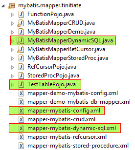

# MyBatis demonstration using Mapper XML to perform Dynamic SQL Execution Oracle DB (Non Maven)
* Here we demonstrate a MyBatis - Oracle application with a Dynamic SQL operation.
* This application uses Mapper XML of MyBatis to Read Data using Dynamic SQL
  based on input data Oracle DB table data.
* We connect to Oracle DB and work on a Oracle table with various DataTypes.
* STEPS INVOLVED
  * **PROJECT SETUP SCREENSHOT:**


  * `PRE REQ.` Add the MyBatis JAR and Oracle JDBC JAR to your project.
  * `STEP 1.` Create Oracle Table TestTable and Data.
  * `STEP 2.` MyBatis Config XML File.
  * `STEP 3.` MyBatis Mapper XML File.
  * `STEP 4.` Create Java TestTable Table POJO Classes.
  * `STEP 5.` Create Java MyBatis Mapper Dynamic SQL Java Code.


## STEP 1. Create Oracle Tables
* In this step we create TestTable Oracle table.
* Make sure the `SCHEMA` in which these tables are created, is used as the
  Oracle user in the MyBatis Config XML.
* In our case we are creating the tables in `tinitiate` schema in Oracle.
```
-- TestTable TABLE
--
-- Drop if exists
drop table TestTable
/

-- Create TestTable Table
create table TestTable (
    test_id       number not null
   ,test_date     date
   ,test_str      varchar2(14)
   ,test_decimal  number(10,4)
)
/

-- Insert Data, This is requried as the subsequent code assumes there is data
begin
    insert into TestTable (test_id, test_date, test_str, test_decimal)
    values(1,sysdate,'AAA',10.10);
    insert into TestTable (test_id, test_date, test_str, test_decimal)
    values(2,sysdate,'BBB',12.10);
    insert into TestTable (test_id, test_date, test_str, test_decimal)
    values(3,sysdate,'CCC',13.10);
    insert into TestTable (test_id, test_date, test_str, test_decimal)
    values(4,sysdate,'DDD',14.10);
    --
    commit;
end
/
```


## STEP 2. The MyBatis Config File: mapper-mybatis-config.xml
* This is a Config for connecting to Oracle Database
* The URL must have the HostName where the Oracle DB is installed and the 
  Oracle Database name.
  `jdbc:oracle:thin:@//<HOST-NAME>:1521/<DATABASE-NAME>`
* The XML Config file has the Mapper reference to the Mapper XML file.
```
<?xml version="1.0" encoding="UTF-8"?>
<!DOCTYPE configuration
  PUBLIC "-//mybatis.org//DTD Config 3.0//EN"
  "http://mybatis.org/dtd/mybatis-3-config.dtd">
<configuration>
    <environments default="development">
        <environment id="development">
            <transactionManager type="JDBC"/>
            <dataSource type="POOLED">
                <property name="driver" value="oracle.jdbc.OracleDriver"/>
                <property name="url" value="jdbc:oracle:thin:@//localhost:1521/ORCL"/>
                <property name="username" value="tinitiate"/>
                <property name="password" value="tinitiate"/>
            </dataSource>
        </environment>
    </environments>

    <mappers>
        <mapper resource="mybatis/mapper/tinitiate/mapper-mybatis-dynamic-sql.xml"/>
    </mappers>
</configuration>
```


## STEP 3: Create MyBatis Mapper Details XML File.
* The Mapper XML file has SQL statements that will be executed in the DataBase
* They have XML `<SELECT>` tag .. have an ID associated 
  to them. This ID is used along with the **NAMESPACE** of the MAPPER in the XML
* The `resultType` `parameterType` and `resultMap` is what the SQL gets back,
  it is tied to Java DataTypes both native and objects.
```
<?xml version='1.0' encoding='UTF-8' ?>
<!DOCTYPE mapper PUBLIC '-//mybatis.org//DTD Mapper 3.0//EN'
'http://mybatis.org/dtd/mybatis-3-mapper.dtd'>

<mapper namespace = "mybatis.mapper.tinitiate.TestTable">

    <resultMap type="mybatis.mapper.tinitiate.TestTablePojo" id="TestTableResult">
        <id property="test_id" column="test_id"/>
        <result property="test_date" column="test_date"/>
        <result property="test_str" column="test_str"/>
        <result property="test_decimal" column="test_decimal"/>   
    </resultMap>

    <!-- Get all records of TestTable, Get records with matching #{test_id} or
         Get records with matching #{test_str} -->
    <select id = "IfTest" 
            parameterType = "mybatis.mapper.tinitiate.TestTablePojo" 
            resultType = "mybatis.mapper.tinitiate.TestTablePojo" 
            resultMap = "TestTableResult">
        select * from TestTable
        <if test = "test_id != -1">
            where test_id = #{test_id}
        </if>
        <if test = "test_str != -1">
            where test_str = #{test_str}
        </if>
    </select>

    <!--  Choose: This works as IF..ELSE -->
	<select id = "ChooseTest"
	        parameterType = "mybatis.mapper.tinitiate.TestTablePojo" 
	        resultType = "mybatis.mapper.tinitiate.TestTablePojo" 
	        resultMap = "TestTableResult">
		select * from TestTable
		<choose>
		    <when test="test_id != -1">
		        where test_id = #{test_id}
		    </when>
		    <when test="test_str != '-1'">
		        where test_str = #{test_str}
		    </when>
		    <otherwise>
		        where test_id > -1
		    </otherwise>
		</choose>
	</select>

    <!-- FOR: Ideal to use with IN clause to loop through a list of values input -->
	<select id="InClause"
	        parameterType = "java.util.List" 
	        resultType="mybatis.mapper.tinitiate.TestTablePojo"
	        resultMap = "TestTableResult">
        select * from TestTable where test_id in
        <foreach item="element" index="index" collection="list" open="(" separator="," close=")">
            #{element}
        </foreach>
    </select>

</mapper>
```


## STEP 4. Create Java TestTable Table POJO Classes.
* A Java POJO file that represents the Oracle tables Columns is needed
  to map a Java Object with a row or rowset of the oracle table.
```
package mybatis.mapper.tinitiate;

import java.util.Date;

public class TestTablePojo {

    public int test_id;
    public Date test_date;
    public String test_str;
    public double test_decimal;
}
```


### STEP 5. Java Class to demonstrate the Dynamic SQL
* The java class that handles the Dynamic SQL operation
* The first operation is to use the XML Config file
* Create the POJO Objects for Data
* Read the Config XML file.
* Perform individual Dynamic SQL operations using the IDs from the XML file.
* Individual calls (Select IDs) to the Mapper XML files include 
    * `Dynamic SQL "MAPPER IF" Example`
    * `MAPPER CHOOSE CLAUSE`
    * `MAPPER IN CLAUSE`
```
package mybatis.mapper.tinitiate;

import java.io.IOException;
import java.io.Reader;
import java.text.ParseException;
import java.text.SimpleDateFormat;
import java.util.ArrayList;
import java.util.List;
import org.apache.ibatis.io.Resources;
import org.apache.ibatis.session.SqlSession;
import org.apache.ibatis.session.SqlSessionFactory;
import org.apache.ibatis.session.SqlSessionFactoryBuilder;

public class MyBatisMapperDynamicSQL {

    public static void main(String[] args) throws ParseException {

        Reader reader;

        // Record with test_str NULL
        // =========================
        TestTablePojo TTObj1 = new TestTablePojo();
        TTObj1.test_id = 1;
        TTObj1.test_str = "-1";
        TTObj1.test_date = new SimpleDateFormat("dd-MM-yyyy").parse("01-02-2013");
        TTObj1.test_decimal = 10.1;

        // Record with test_id NULL
        // ========================
        TestTablePojo TTObj2 = new TestTablePojo();
        TTObj2.test_id = -1;
        TTObj2.test_date = new SimpleDateFormat("dd-MM-yyyy").parse("01-02-2018");
        TTObj2.test_decimal = 99.1;
        TTObj2.test_str = "BBB";

        try {
            reader = Resources.getResourceAsReader("mybatis/mapper/tinitiate/mapper-mybatis-config.xml");
            SqlSessionFactory sqlSessionFactory = new SqlSessionFactoryBuilder().build(reader);
            SqlSession session = sqlSessionFactory.openSession();

            // Dynamic SQL "MAPPER IF" Example 
            // ===============================
            List<TestTablePojo> Rows1 = session.selectList("mybatis.mapper.tinitiate.TestTable.IfTest", TTObj1); 
            
            for(TestTablePojo tt : Rows1) {
                System.out.println(tt.test_id + " " + tt.test_date.toLocaleString()
                                   + " " + tt.test_decimal + " " + tt.test_str);
            }


            // Dynamic SQL "MAPPER CHOOSE CLAUSE" Example
            // ==========================================
            List<TestTablePojo> Rows2 = session.selectList("mybatis.mapper.tinitiate.TestTable.ChooseTest", TTObj2); 

            for(TestTablePojo tt : Rows2) {
                System.out.println(tt.test_id + " " + tt.test_date.toLocaleString()
                                   + " " + tt.test_decimal + " " + tt.test_str);
            }


            // Dynamic SQL "MAPPER IN CLAUSE" Example
            // ======================================
            List<Integer> TestIDs = new ArrayList<Integer>(); 
            TestIDs.add(1);
            TestIDs.add(2);
            TestIDs.add(3);
            TestIDs.add(4);

            
            List<TestTablePojo> Rows3 = session.selectList("mybatis.mapper.tinitiate.TestTable.InClause", TestIDs);
            
            for(TestTablePojo tt : Rows3) {
                System.out.println(tt.test_id + ' ' + tt.test_date.toLocaleString()
                                   + ' ' + tt.test_decimal + ' ' + tt.test_str);
            }


            // Close Session
            // =============
            session.close();

        } catch (IOException e) { e.printStackTrace(); }
    }
}
```
