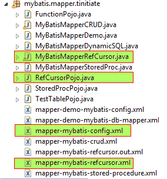

# MyBatis Demonstration using Mapper XML to read Oracle RefCursor
* Here we demonstrate a MyBatis - Oracle application
* This application uses a mapper XML whihc holds the information of SQL that 
  will become the data source from the Oracle DB for MyBatis.
* We connect to Oracle DB to Execute a Stored Procecure and a Function
* STEPS INVOLVED
* `STEP 1.` Add the MyBatis JAR and Oracle JDBC JAR to your project. 
* `STEP 2.` Create the Oracle Stored Procedure with RefCursor
* `STEP 3.` Create the Mapper XML File
* `STEP 4.` Create the Config XML File
* `STEP 5.` Create the POJO files to represent the Oracle Stored 
   Procedure's RefCursor OUT parameter
* `STEP 6.` Create the Java Class to use the XML Mapper file to supply the 
  parameters and execute the Oracle Stored Procecure and Oracle function.
* Project Folder Structure



## Demonstration of MyBatis Reading Oracle RefCursor using Mapper XML
* Here are the Steps invloved to create a MyBatis Mapper Application
* The process invloves Creating a mybatis config mapper details a mapper XML
  file, that has the SQL code.
* `Code Steps`: The following are the CODE files required to run the project. 
* `STEP 1.` Create the Oracle Stored Procedure with RefCursor
* `STEP 2.` Create the Mapper XML File
* `STEP 3.` Create the Config XML File
* `STEP 4.` Create the POJO files to represent the Oracle Stored 
   Procedure's RefCursor OUT parameter
* `STEP 5.` Create the Java Class to use the XML Mapper file to supply the 
  parameters and execute the Oracle Stored Procecure and Oracle function.


### STEP 1: Create the Oracle Stored Procecure that returns a RefCursor
* This Oracle Stored Procecure returns a refcursor as an OUT parameter.
```
create or replace procedure pr_get_refcursor(p_refcur out sys_refcursor)
is
begin
    open p_refcur for
    select 1 num,'abc' str, sysdate ddate from dual
    union all
    select 2 num,'pqr' str, sysdate+1 ddate from dual
    union all
    select 3 num,'xyz' str, sysdate+2 ddate from dual;
end pr_get_refcursor;
/
```


### STEP 2: Create MyBatis Mapper XML File.
* The Mapper XML file has SQL statements that map to the Oracle Stored 
  Procecure and Function.
* The XML tags Select ties the results to the ResultMap.
  to them. This ID is used along with the **NAMESPACE** of the MAPPER in the XML
* The `resultMap` is what the SQL gets back, it is tied to Java DataTypes 
  both native and objects.
```
<?xml version='1.0' encoding='UTF-8' ?>
<!DOCTYPE mapper PUBLIC '-//mybatis.org//DTD Mapper 3.0//EN'
  'http://mybatis.org/dtd/mybatis-3-mapper.dtd'>

<mapper namespace="mybatis.mapper.tinitiate.refcursor">

	<resultMap id="refCurRes" type="mybatis.mapper.tinitiate.RefCursorPojo">
		<result property="num" column="num"/>
		<result property="str" column="str"/>
		<result property="ddate" column="ddate"/>
	</resultMap>

    <select id="runRefCursor" parameterType="java.util.Map" statementType="CALLABLE">
        {CALL pr_get_refcursor( #{ p_refcur
                                  ,mode=OUT
                                  ,jdbcType=CURSOR
                                  ,javaType=java.sql.ResultSet
                                  ,resultMap=refCurRes} )}
    </select>
</mapper>
```


### STEP 3: Create MyBatis Config XML File.
* The MyBatis Config XML file has DB Connection details and the Mapper XML Path
* Mapper XML path is relative to the pacakge Path of Java
* If pacakge is `mybatis.mapper.tinitiate/` the path is used as:
  `mybatis/mapper/tinitiate/`
```
<?xml version="1.0" encoding="UTF-8"?>
<!DOCTYPE configuration
  PUBLIC "-//mybatis.org//DTD Config 3.0//EN"
  "http://mybatis.org/dtd/mybatis-3-config.dtd">
<configuration>
    <environments default="development">
        <environment id="development">
            <transactionManager type="JDBC"/>
            <dataSource type="POOLED">
                <property name="driver" value="oracle.jdbc.OracleDriver"/>
                <property name="url" value="jdbc:oracle:thin:@//localhost:1521/ORCL"/>
                <property name="username" value="tinitiate"/>
                <property name="password" value="tinitiate"/>
            </dataSource>
        </environment>
    </environments>

    <mappers>
        <mapper resource="mybatis/mapper/tinitiate/mapper-mybatis-refcursor.xml"/>
    </mappers>

</configuration>
```


### STEP 4. Java POJO to represent the Stored Procedure's RefCursor OUT parameter
* The RefCursorPojo Java POJO to represent the Stored Procedure's RefCursor 
  OUT parameter.
```
package mybatis.mapper.tinitiate;

import java.util.Date;

public class RefCursorPojo {
    public int num;
    public String str;
    public Date ddate;
}
```


### STEP 5. Create Java File Execute SQL from MyBatis Mapper XML
* The Java code calls the MyBatis Config XML
* This creates a Reader / SqlSessionFactory / SqlSession, Using the 
  SqlSession Object a `selectOne` calls the NAMESPACE.SQL-ID from the Mapper XML
```
package mybatis.mapper.tinitiate;

import org.apache.ibatis.io.Resources;
import org.apache.ibatis.session.SqlSession;
import org.apache.ibatis.session.SqlSessionFactory;
import org.apache.ibatis.session.SqlSessionFactoryBuilder;
import java.io.IOException;
import java.io.Reader;
import java.sql.ResultSet;
import java.text.ParseException;
import java.util.ArrayList;
import java.util.HashMap;
import java.util.Map;

public class MyBatisMapperRefCursor {
    
    public static void main(String[] args) throws ParseException {
        try {
            Reader reader = Resources.getResourceAsReader("mybatis/mapper/tinitiate/mapper-mybatis-config.xml");
            SqlSessionFactory sqlSessionFactory = new SqlSessionFactoryBuilder().build(reader);
            SqlSession session = sqlSessionFactory.openSession();

            Map<String, Object> params = new HashMap<String, Object>();
            ResultSet rs = null;
            params.put("p_refcur", rs);
            session.selectList("mybatis.mapper.tinitiate.refcursor.runRefCursor", params);

            for(RefCursorPojo r : (ArrayList<RefCursorPojo>)params.get("p_refcur")) {
                System.out.println(r.num + " " + r.str + " " + r.ddate);
            }

        }  catch (IOException e) { e.printStackTrace(); }
    }
}
```
