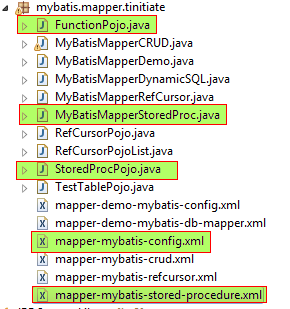

# MyBatis demonstration using Mapper XML executing Oracle Stored Procedure
* Here we demonstrate a MyBatis - Oracle application
* This application uses a mapper XML whihc holds the information of SQL that 
  will become the data source from the Oracle DB for MyBatis.
* We connect to Oracle DB to Execute a Stored Procecure and a Function
* STEPS INVOLVED
* `STEP 1.` Add the MyBatis JAR and Oracle JDBC JAR to your project. 
* `STEP 2.` Create the Oracle Stored Procedure and the Function
* `STEP 3.` Create the Mapper XML File
* `STEP 4.` Create the Config XML File
* `STEP 5.` Create the POJO files to represent the Oracle Stored 
   Procedure and the Function parameters 
* `STEP 6.` Create the Java Class to use the XML Mapper file to supply the 
  parameters and execute the Oracle Stored Procecure and Oracle function.
* Project Folder Structure



## Demonstration of Non Maven MyBatis Executing Oracle Stored Procedure and Function using Mapper XML
* Here are the Steps invloved to create a MyBatis Mapper Application
* The process invloves Creating a mybatis config mapper details a mapper XML
  file, that has the SQL code.
* `Code Steps`: The following are the CODE files required to run the project. 
* Steps to follow:
* `STEP 1.` Add the MyBatis JAR and Oracle JDBC JAR to your project. 
* `STEP 2.` Create the Oracle Stored Procedure and the Function
* `STEP 3.` Create the Mapper XML File
* `STEP 4.` Create the Config XML File
* `STEP 5.` Create the POJO files to represent the Oracle Stored 
   Procedure and the Function parameters 
* `STEP 6.` Create the Java Class to use the XML Mapper file to supply the 
  parameters and execute the Oracle Stored Procecure and Oracle function.


### STEP 1: Create the Oracle Stored Procecure and the Function

#### Oracle Stored Procedure used for demonstration
* This Oracle Stored Procecure adds two numbers and returns the value as an 
  Out Parameter.
```
drop procedure sp_add_numbers
/

create or replace procedure sp_add_numbers
    (n1 in int, n2 in int, res out int)
as
begin
    res := n1 + n2;
end sp_add_numbers
/
```
#### Oracle Function used for demonstration
* This Oracle Function adds two numbers and returns the value.
```
drop function fn_add_numbers
/

create or replace function fn_add_numbers
(n1 int, n2 int)
return int
as
begin
    return n1 + n2;
end fn_add_numbers
/
```


### STEP 2: Create MyBatis Mapper XML File.
* The Mapper XML file has SQL statements that map to the Oracle Stored 
  Procecure and Function.
* The XML tags Select ties the results to the ResultMap.
  to them. This ID is used along with the **NAMESPACE** of the MAPPER in the XML
* The `resultType` is what the SQL gets back, it is tied to Java DataTypes 
  both native and objects.
```
<?xml version="1.0" encoding="UTF-8"?>
<!DOCTYPE mapper PUBLIC "-//mybatis.org//DTD Mapper 3.0//EN" "http://mybatis.org/dtd/mybatis-3-mapper.dtd">

<mapper namespace = "mybatis.mapper.tinitiate.TestProc">

   <resultMap id = "result" type = "mybatis.mapper.tinitiate.StoredProcPojo">
      <result property = "N1" column = "N1"/>
      <result property = "N2" column = "N2"/>
      <result property = "RES" column = "RES"/>
   </resultMap>

    <select id="oraProcCall" statementType="CALLABLE">
        {CALL sp_add_numbers( #{N1, jdbcType = INTEGER, mode = IN}
                             ,#{N2, jdbcType = INTEGER, mode = IN}
                             ,#{RES, jdbcType = INTEGER, mode = OUT} )}
    </select>

    <select id="oraFuncCall" resultType="java.lang.Integer" statementType="CALLABLE">
        select fn_add_numbers( #{N1, jdbcType = INTEGER, mode = IN}
                              ,#{N2, jdbcType = INTEGER, mode = IN})
        from   dual
    </select>

</mapper>
```


### STEP 2: Create MyBatis Config XML File.
* The MyBatis Config XML file has DB Connection details and the Mapper XML Path
* Mapper XML path is relative to the pacakge Path of Java
* If pacakge is `mybatis.mapper.tinitiate/` the path is used as:
  `mybatis/mapper/tinitiate/`
```
<?xml version="1.0" encoding="UTF-8"?>
<!DOCTYPE configuration
  PUBLIC "-//mybatis.org//DTD Config 3.0//EN"
  "http://mybatis.org/dtd/mybatis-3-config.dtd">
<configuration>
    <environments default="development">
        <environment id="development">
            <transactionManager type="JDBC"/>
            <dataSource type="POOLED">
                <property name="driver" value="oracle.jdbc.OracleDriver"/>
                <property name="url" value="jdbc:oracle:thin:@//localhost:1521/ORCL"/>
                <property name="username" value="tinitiate"/>
                <property name="password" value="tinitiate"/>
            </dataSource>
        </environment>
    </environments>

    <mappers>
        <mapper resource="mybatis/mapper/tinitiate/mapper-mybatis-stored-procedure.xml"/>
    </mappers>

</configuration>
```

### STEP 3. POJO Java Classes to represent the Oracle Stored Procecure and Function Parameters
* **The Stored Procedure Parameters POJO**
```
package mybatis.mapper.tinitiate;

public class StoredProcPojo {

    public Integer N1;
    public Integer N2;
    public Integer RES;
}
```
* **The Stored Procedure Parameters POJO**
```
package mybatis.mapper.tinitiate;

public class FunctionPojo {
    public int N1;
    public int N2;
}
```


### STEP 4. Create Java File Execute SQL from MyBatis Mapper XML
* The Java code calls the MyBatis Config XML
* This creates a Reader / SqlSessionFactory / SqlSession, Using the 
  SqlSession Object a `selectOne` calls the NAMESPACE.SQL-ID from the Mapper XML
```
package mybatis.mapper.tinitiate;

import java.io.IOException;
import java.io.Reader;
import java.text.ParseException;
import org.apache.ibatis.io.Resources;
import org.apache.ibatis.session.SqlSession;
import org.apache.ibatis.session.SqlSessionFactory;
import org.apache.ibatis.session.SqlSessionFactoryBuilder;


public class MyBatisMapperStoredProc {

    public static void main(String[] args) throws ParseException {
        try {
            Reader reader = Resources.getResourceAsReader("mybatis/mapper/tinitiate/mapper-mybatis-config.xml");
            SqlSessionFactory sqlSessionFactory = new SqlSessionFactoryBuilder().build(reader);
            SqlSession session = sqlSessionFactory.openSession();

            // USE SELECT ONE RECORD TO EXECUTE ORACLE FUNCTION and PROCEDURE
            // ==============================================================

            // ORACLE PROCEDURE
            // ================
            StoredProcPojo SPparams = new StoredProcPojo();
            SPparams.N1 = 10;
            SPparams.N2 = 20;
            SPparams.RES = null;
            session.selectOne("mybatis.mapper.tinitiate.TestProc.oraProcCall", SPparams);
            System.out.println(SPparams.RES);

            // ORACLE FUNCTION
            // ===============
            FunctionPojo FNparams = new FunctionPojo();
            FNparams.N1 = 1;
            FNparams.N2 = 2;
            Integer RES = session.selectOne("mybatis.mapper.tinitiate.TestProc.oraFuncCall", FNparams);
            System.out.println(RES);

            // Close Session
            // =============
            session.close();

        } catch (IOException e) { e.printStackTrace(); }
    }    
}
```
