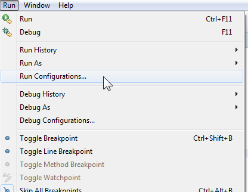
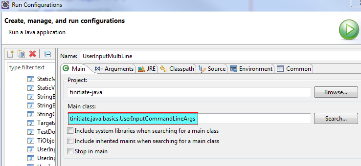
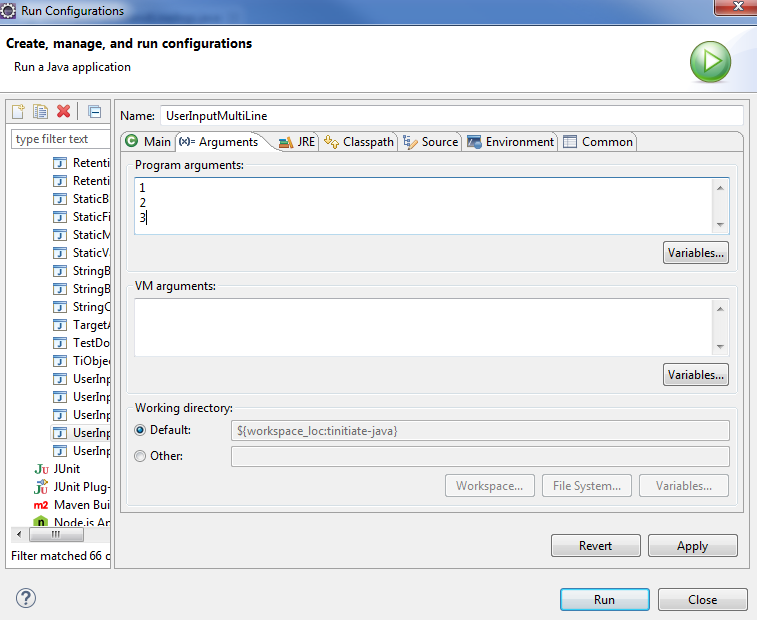

# Java Reading User Input
* Reading keyboard input or user input in Java can be acheived in multiple ways
* Reading single line user input using Scanner Class
* Reading single line user input using BufferedReader class and InputStreamReader class
* Reading single line user input using Console class
* Reading Multiline user input using
* Read Commandline arguments from Console
* Read Commandline arguments from Eclipse IDE


## User Input Using Scanner Class
```
package tinitiate.java.basics;

import java.util.Scanner;

public class UserInputScanner {

    public static void main(String[] args) {

        Scanner s = new Scanner(System.in);
        
        // Read String User Input
        System.out.println("Enter String Data:");
        String sData = s.next();

        // Read Integer User Input
        System.out.println("Enter Integer Data:");
        int iData = s.nextInt();

        // Read Integer User Input
        System.out.println("Enter Decimal Data:");
        double dData = s.nextDouble();
        
        // Display the Input Data
        System.out.println(sData);
        System.out.println(iData);
        System.out.println(dData);        
    }
}
```


## User Input Using BufferedReader class and InputStreamReader class
```
package tinitiate.java.basics;

import java.io.BufferedReader;
import java.io.IOException;
import java.io.InputStreamReader;

public class UserInputBufferedReader {

    public static void main(String[] args) throws IOException {

        BufferedReader brObj = new BufferedReader(new InputStreamReader(System.in));

        System.out.println("Enter String User Input:");
        String sData = brObj.readLine();

        System.out.println("Enter Integer User Input:");
        int iData = Integer.parseInt(brObj.readLine());
        
        // Display the Input Data
        System.out.println(sData);
        System.out.println(iData);
    }
}
```


## User Input Using Console class
* Using Console Class in IDE such as Eclipse will return null, 
* `DONT USE Console Class in an IDE`
```
package tinitiate.java.basics;

import java.io.Console;

public class UserInputConsoleClass {

    public static void main(String[] args) {
    
        Console console = System.console();

        // Read String User Input
        String sData = console.readLine("Enter String Data:");
       
        // Display the Input Data
        System.out.println(sData);
    }    
}
```


## Read multi-line user input
```
package tinitiate.java.basics;

import java.io.BufferedReader;
import java.io.IOException;
import java.io.InputStreamReader;

public class UserInputMultiLine {

    public static void main(String args[]) throws IOException {

        BufferedReader stdin = new BufferedReader(new InputStreamReader(System.in));
        String line;
        String Output = "Entered Input: ";
        
        System.out.println("Enter Multiline Input, Use TWO EMPLYLINES to end accepting input:");
        while ((line = stdin.readLine()) != null && line.length()!= 0) {

            Output = Output + line + "\n";
        }
        System.out.println(Output);
    }
}
```


## Read Commandline Arguments
* Java programs can be passed arguments after the file name
```
package tinitiate.java.basics;

public class UserInputCommandLineArgs {

    public static void main(String[] args) {

        for(int i=0; i< args.length; i++) {

            System.out.println(args[i]);
        }
    }
}
```


### Running Commandline arguments code in **Eclipse IDE**
* **STEP 1.** Click on the Run Congurations
* 
* **STEP 2.** Select the Class that has the read commandline arguments logic
* 
* **STEP 3.** Enter user inputs and click `RUN`
* 

### Running Commandline arguments code at commandline
* At the Commandline enter the Class File Name with the Arguments seperated by space.
```
java UserInputCommandLineArgs 1 2 3
```
